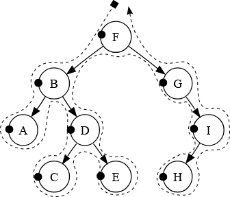
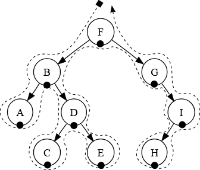
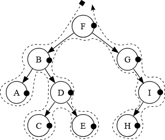
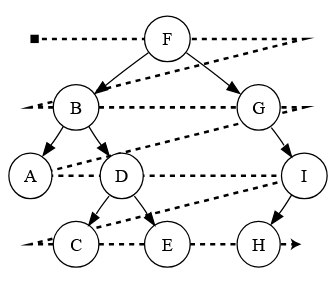

#### [[Вопросы к Экзамену]]
---
### Описание
#### Дерево
Дерево — абстрактный тип данных, моделирующий иерархичную древовидную структуру, в которой существует только один корень и узлы, связанные отношениями *потомок-родитель*, где любой отдельно взятый элемент имеет только одного родителя (кроме корня, у него родителя нет).
Двоичное (бинарное) дерево — это дерево, в котором у каждого узла не больше двух потомков.
#### Обходы дерева
Под обходом дерева понимается последовательных обход всех элементов дерева. Есть три вида обхода:
1. Прямой обход (КЛП): *корень* $\to$ *левое поддерево* $\to$ *правое поддерево*
2. Центрированный обход (ЛКП): *левое поддерево* $\to$ *корень* $\to$ *правое поддерево*
3. Обратный обход: (ЛПК): *левое поддерево* $\to$ *правое поддерево* $\to$ *корень*
<div style="background-color:white; display:flex; width: fit-content; border-radius: 10px">
	<div style="margin-left:5px;margin-right:5px">
		<p style="color:black;text-align:center;margin-top:5px">Прямой обход</p>
		
	</div>
	<div style="margin-left:5px;margin-right:5px">
		<p style="color:black;text-align:center;margin-top:5px">Центрированный обход</p>
		
	</div>
	<div style="margin-left:5px;margin-right:5px">
		<p style="color:black;text-align:center;margin-top:5px">Обратный обход</p>
		
	</div>
</div>
Такие обходы называются *поиском в глубину*, поскольку на каждом шаге итератор сначала пытается продвинуться вниз по дереву перед тем, как перейти к родственному узлу. Ещё существует обход в ширину, в котором итератор сначала проходит по всем элементам уровня, а уже после идёт глубже.
<div style="background-color:white; display:flex; width:fit-content; border-radius: 10px">
	<div style="margin-left:5px;margin-right:5px">
		<p style="color:black;text-align:center;margin-top:5px">Обход в ширину</p>
		
	</div>
</div>
### Реализация
Рекурсивный поиск в глубину
```python
def preorder(node):
  if (node == null)
    return
  visit(node)
  preorder(node.left)
  preorder(node.right)
```

Поиск в глубину через стек
```python
def iterativePreorder(node):
  s = empty stack
  s.push(node)
  while (not s.isEmpty())
    node = s.pop()
    visit(node)
    if (node.right != null)
      s.push(node.right)
    if (node.left != null)
      s.push(node.left)
```

Обход в ширину
```python
def levelorder(root):
  q = empty queue
  q.enqueue(root)
  while (not q.isEmpty())
    node = q.dequeue()
    visit(node)
    if (node.left != null)
      q.enqueue(node.left)
    if (node.right != null)
      q.enqueue(node.right)
```