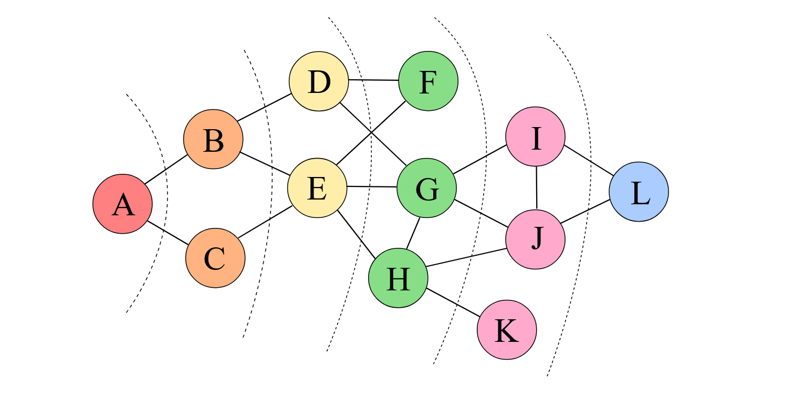

#### [[Вопросы к Экзамену]]
---
Граф — нелинейная структура данных, состоящая из вершин (узлов) и рёбер (связей), которые их соединяют, моделируя отношения между объектами.
<div style="background-color:white; display:flex; width:fit-content; border-radius: 10px">
	<div style="margin: 5px">
		
	</div>
</div>

### Способы представления графа

1. Списки смежности
	```python
	[a] -> a:2 -> b:5 -> d:8
	[b] -> c:7 -> d:9
	[c] -> d:4
	[d] -> c:3
	```
2. Списки рёбер
	```python
	[a,a,2]
	[a,b,5]
	[a,d,8]
	[b,c,7]
	[b,d,9]
	[c,d,4]
	[d,c,3]
	```
3. Матрицы смежности
	```python
	   a  b  c  d
	a  2  5  0  8
	b  0  0  7  9
	c  0  0  0  4
	d  0  0  3  0
	```
4. Матрицы идентичности
	```python
	       a  b  c  d
	(a,a)  2  0  0  0
	(a,b)  0  5  0  0
	(a,d)  0  0  0  8
	(b,c)  0  0  7  0
	(b,d)  0  0  0  9
	(c,d)  0  0  0  4
	(d,c)  0  0  3  0
	```

*Списки смежности* и *списки рёбер* являются компактными и удобными в том случае, когда граф является разреженным. В случае со списком смежности хранение представляет собой массив вершин графа, для каждой из которых определены все вершины в которые можно попасть из неё.

*Матрица смежности* и *матрица идентичности* являются более удобным представлением в том случае, если огда нужно быстро отвечать на вопрос «является ли данное ребро инцидентно к…» или аналогичные. Но, если графы не плотные (а разреженные), то занимается существенное количество памяти. 
*Матрица смежности* состоит из таблицы размером $|V| \times |V|$, где на пересечении для каждой пары вершин находится или признак того, что ребро между ними существует (для неориентированных графов), либо вес ребра. 
*Матрица инцидентности* имеет размер $|V| \times |E|$, а её пересечении говорит о том, что данное ребро инцидентно вершине (то есть один из её концов содержит вершину). В случае ориентированного графа в матрице смежности используются положительные числа для того, чтобы обозначить, что ребро выходит из этой вершины.
### Поиск в ширину
На вход алгоритма подаётся _невзвешенный_ граф и номер стартовой вершины ss. Граф может быть как ориентированным, так и неориентированным — для алгоритма это не важно.
Основную идею алгоритма можно понимать как процесс «поджигания» графа: на нулевом шаге мы поджигаем вершину ss, а на каждом следующем шаге огонь с каждой уже горящей вершины перекидывается на всех её соседей, в конечном счете поджигая весь граф.
Если моделировать этот процесс, то за каждую итерацию алгоритма будет происходить расширение «кольца огня» в ширину на единицу. Номер шага, на котором вершина $v$ начинает гореть, в точности равен длине её минимального пути из вершины $s$.
<div style="background-color:white; display:flex; width:fit-content; border-radius: 10px">
	<div style="margin: 5px">
		
	</div>
</div>

Моделировать это можно следующим образом. Создадим очередь, в которую будут помещаться горящие вершины, а также заведём булевый массив, в котором для каждой вершины будем отмечать, горит она или нет — или иными словами, была ли она уже посещена. Изначально в очередь помещается только вершина $s$, которая сразу помечается горящей.
Затем алгоритм представляет собой такой цикл: пока очередь не пуста, достать из её головы одну вершину $v$, просмотреть все рёбра, исходящие из этой вершины, и если какие-то из смежных вершин $u$ ещё не горят, поджечь их и поместить в конец очереди.
```python
def BFS(graph, s):
  queue = Queue()
  queue.enqueue(s)
  visited = ()
  visited.append(s)
  while not queue.empty():
    v = q.dequeue()
    visited.append(v)
    visit(v)
    for u in graph[v]:
      if u not in visited:
        queue.enqueue(u)
```
### Поиск кратчайшего пути
Алгоритм поиска кратчайшего пути основывается на поиске в ширину. Если в процессе прохождения создать `map`, которая для каждой вершины хранит вершину, из которой в неё пришли, то после завершения поиска в ширину будет достаточно пройтись по этому `map` от вершины, в которую мы хотим прийти, до вершины, из которой начинался поиск в ширину. Понятно, что в такой реализации будет возвращён путь из конца в начало.

```python
def path(graph, s, w):
  queue = Queue()
  queue.enqueue(s)
  visited = []
  path = {} # map
  visited.append(s)
  while not queue.empty():
    v = q.dequeue()
    visited.append(v)
    visit(v)
    for u in graph[v]:
      if u not in visited:
        queue.enqueue(u)
        path[u] = v # пришли в u из v
  while w != s: # возвращение пути 
    yield w
    w = path[w]
```